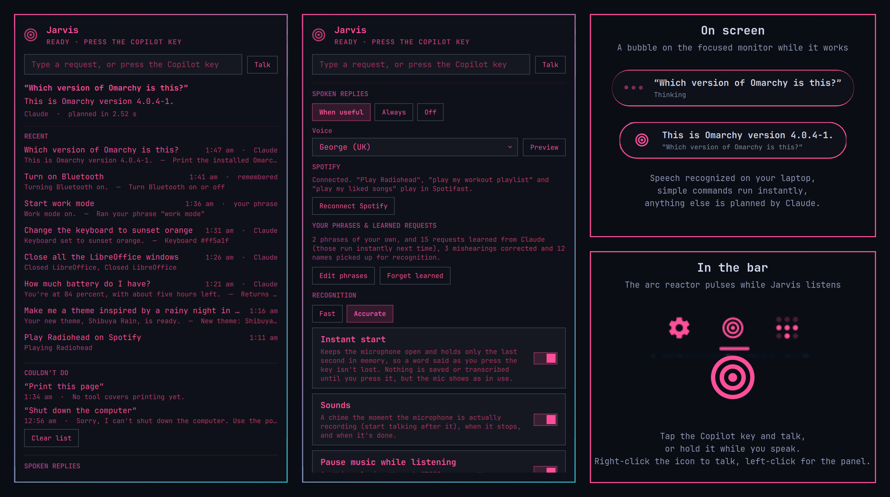

# Jarvis (grivera.jarvis)

**A voice assistant for Omarchy.** Press the Copilot key (or any shortcut you
pick), say what you want, and Jarvis does it: open and arrange apps, switch workspaces, play music, change
settings, answer questions, and even design you a new theme.

Speech recognition and Jarvis's voice run locally on your laptop. Simple
commands happen instantly; anything else is planned by Claude or Codex (your
pick), which can only choose from a fixed set of safe actions that Jarvis
checks before running.



## Install

Use Omarchy's plugin manager:

```
omarchy plugin add https://github.com/grivera82/omarchy-jarvis.git --enable
```

This clones the plugin into `~/.config/omarchy/plugins/grivera.jarvis` and adds
the arc reactor icon to your bar. Then:

1. **Download the speech models.** Click the icon and press **Set up**, or run
   `~/.config/omarchy/plugins/grivera.jarvis/bin/jarvis setup`. It creates a
   Python environment with faster-whisper and Kokoro and downloads the models
   (about 1.5 GB, in `~/.local/share/grivera-jarvis/`). A few minutes, once.
   The Python packages are the exact tested versions in `lib/requirements.txt`,
   and every model file is checked against a SHA-256 before it's used.
2. **Pick a shortcut.** After setup the panel asks which key should start
   Jarvis: the Copilot key, Super+Alt+J, Super+Alt+A, or no key at all
   (right-click the bar icon or press **Talk** instead). Any other combination
   can be set under **Shortcut**, and the panel always shows the key in use.
   Jarvis binds it in Hyprland itself (no config files touched), tells you if
   a combination is already used and by what, and re-applies the binding
   whenever Hyprland reloads. Until you choose, the Copilot key works, taking
   it over from Omarchy's menu. You can always type a request instead.
3. **Make sure Claude Code or Codex is installed and signed in** (`claude` or
   `codex` on your PATH). Jarvis uses it, with no tools, to plan requests the
   built-in commands don't cover: Claude Code with the fast Haiku model, or
   Codex with GPT-6-Luna. Pick one under **Cloud model** in the panel; if only
   one is installed, that one is used. Claude is the default and the most
   tested: Jarvis was built with it, and it's faster (about 3 s against 5 s).
   Codex works too, and is handy if that's the subscription you have. Your
   subscription or API key works as is.

To update or remove it: `omarchy plugin update grivera.jarvis`,
`omarchy plugin remove grivera.jarvis`. Removing the plugin leaves its data
behind; to delete that too (about 1.5 GB, mostly models):

```
rm -rf ~/.local/share/grivera-jarvis ~/.local/state/grivera-jarvis ~/.config/grivera-jarvis
```

## What it can do

**Talk to your desktop**
- Tap your shortcut and speak; Jarvis stops when you stop. Or hold the key
  while you talk and let go to send. Press it again to interrupt.
- Say "Hey Jarvis, …" if you like: the name is understood and ignored.
- A bubble at the bottom of the screen shows what it heard, that it's
  thinking, and what it did. Music pauses while you speak and resumes after.

**Apps, windows and workspaces**
- "Open Firefox on workspace 2", "close this window", "move this to workspace 3
  and make it full screen", "switch to Chromium", "float it".
- "Close all the terminals": anything that closes three or more windows asks
  first, and you answer by voice.

**All of Omarchy**
- Jarvis reads Omarchy's own command catalog (`omarchy commands --json`), so it
  can run over a hundred of its commands: screen recording, screenshots and OCR, Bluetooth,
  night light, do not disturb, power profiles, fonts, themes and backgrounds,
  menus and switchers, keyboard backlight, brightness, audio outputs,
  webapps, network status and speed tests, and more.
- Reminders: "remind me in 20 minutes to take the pizza out", "remind me at
  5 to call mom", "what are my reminders?", "clear my reminders". Jarvis keeps
  them itself and shows them as desktop notifications.
- Bar widgets on and off: "disable the Airwaves plugin", "hide the weather
  widget", "show the SpaceX plugin". Only bar widgets: the lock screen, idle,
  notifications and other background services, the bar, the menu and Jarvis
  itself are never switched off by voice.
- Questions get spoken answers from real data: "how much battery do I have?",
  "what's the weather?", "what version of Omarchy am I running?",
  "how fast is my internet?" Plus the time, the date and quick math.

**Music**
- **Spotify through [Spotifast](https://spotifast.rocks)**: "play Radiohead",
  "play Blinding Lights by The Weeknd", "play the album OK Computer",
  "play my workout playlist", "play my liked songs", "what song is this?",
  "like this song", shuffle, repeat, volume.
- **Internet radio in [cliamp](https://github.com/bjarneo/cliamp)**: "play Groove
  Salad in cliamp", "play some jazz radio on cliamp". Stations come from
  radio-browser.info by name or genre.
- Play, pause, next and previous for any player through MPRIS.

**Make things**
- "Make me a new background of a misty pine forest at dawn": Codex paints a
  wallpaper, saves it with your theme's backgrounds and sets it.
- "Make me a theme inspired by a rainy night in Tokyo": Claude (or Codex, if
  it's your cloud model) designs a full Omarchy theme (palette, icons, bar and
  menu colors) and Codex paints a matching wallpaper. It's saved to `~/.config/omarchy/themes/` and applied,
  about a minute later.
- "Change the keyboard to sunset orange" on ASUS laptops with RGB keyboards.
  This needs the `asus-kbd-rgb` tool, which isn't public yet; without it the
  request is simply declined.

**Your own commands**
- Add phrases in `~/.config/grivera-jarvis/phrases.toml` (panel: Edit phrases):

  ```toml
  [[phrase]]
  say = ["work mode", "start work mode"]
  run = "omarchy launch browser https://mail.hey.com && uwsm-app -- obsidian"
  reply = "Work mode on."

  [[phrase]]
  say = "note *"                       # * captures words, passed as {1}
  run = "echo {1} >> ~/notes.txt"      # {1} is passed safely, as a variable
  ```

  Your phrases are checked before anything else and reload when you save.

**It gets better as you use it**
- **Learned requests**: when Claude or Codex handles something successfully, Jarvis
  remembers the plan, so the next time you say it, it runs instantly.
- **Corrections**: "no, I said Chromium" right after a mishearing fixes the
  request and teaches Jarvis that "card running" means Chromium from then on.
  Rephrasing a failed request teaches it too.
- **Your vocabulary**: artists, playlists, stations and apps you use are fed to
  the speech recognizer as hints.
- **"That's wrong"** makes it forget how it handled the last request.
- **Self-tuning**: if requests keep getting cut off, it waits longer for
  pauses; if your mic is distorting, it tells you.
- The panel lists **what it couldn't do**, so you know what to add.

## Use cases

- **Start your day in one sentence**: a "work mode" phrase that opens your mail,
  notes and editor and moves them where you like them.
- **Hands busy**: cooking, eating or holding a guitar. "Pause", "next song",
  "volume to 40", "what song is this?"
- **Window wrangling without shortcuts**: "put Spotify on workspace 4 and close
  the other terminals".
- **Quick answers without leaving what you're doing**: battery, weather, time,
  "what's 18 percent of 64?"
- **Recording and presenting**: "start a screen recording", "turn on do not
  disturb", "hide the bar".
- **Making the desktop yours**: "make me a theme inspired by the Mediterranean
  in summer", then "make me a new background of an olive grove at sunset".
- **Fewer keystrokes**: helpful for RSI, accessibility, or when you can't
  remember the shortcut for something you do twice a year.

## How it works

```
your shortcut ─► jarvis press ─► daemon: microphone (PipeWire) + Silero VAD
                                   │
                       faster-whisper, on your laptop (~0.7 s)
                                   │
   your phrases ─► built-in matcher ─► learned requests ─► Claude (claude -p, Haiku)
     (instant)       (instant)           (instant)          or Codex (codex exec, Luna)
                                                            returns a plan, no tools, 3-5 s
                                   │
       actions, each checked: real window addresses, installed apps,
       http(s) URLs, Omarchy commands by safety tier
                                   │
      a chime, or a spoken reply in a Kokoro voice (local), + the bubble
```

Requests take about 1 second when handled locally, 2 to 4 seconds when
Claude plans them and 4 to 6 seconds with Codex. Speech recognition runs on
the CPU; these times are from a Ryzen AI 7 350 laptop, so older machines will
be slower (the **Fast** recognition setting helps).

## Safety

Neither Claude nor Codex runs anything itself (Codex runs with its shell and
other agent tools turned off). Each only returns a plan made of named actions,
and Jarvis checks every action before running it, without a shell:

- **Allowed**: window and app control, media, toggles, capture, menus,
  brightness, audio, theme and fonts, status questions.
- **Asks first** (you say "yes"): shutting down ("shut down the computer"),
  restarts, default apps, DNS, display scaling, turning off the laptop screen,
  closing three or more windows, webapps.
- **Blocked, and not even shown to the model**: anything needing root rights, installing
  or removing software, updates, refresh/reinstall, reboot and logout, and
  arbitrary shell commands.

Only your own phrases run shell commands, and they're yours to write.

## Privacy

- Your voice is recognized on your laptop and never uploaded. Jarvis's voice
  is generated locally too.
- When a request goes to Claude or Codex, the text of what you said, your open
  window titles and installed app names are sent along so it can plan. For
  questions like "how much battery do I have?", the output of the commands
  that answer it is sent too, so the answer can be phrased. This goes to
  Anthropic or OpenAI under your own account, through the `claude` or `codex`
  CLI, and their usual terms apply. Requests handled locally never leave your
  laptop.
- **Instant start** (off by default; turn it on in the panel) keeps the
  microphone open with only the last second held in memory, so a word said
  as you press the key isn't lost. Nothing is saved or transcribed until you
  press the key, but your system shows the mic as in use. With it off, the
  mic opens only when you press the key, and a word said in that first
  fraction of a second can be lost.
- History, learned data, reminders and the Spotify sign-in stay in
  `~/.local/state/grivera-jarvis/` (files readable only by you). What you say
  is never put on a command line, where other local users could read it:
  reminders go to the notification server over D-Bus, and words captured by
  your phrases reach their command as environment variables. Opening a
  website or a Spotify search hands the link to the app, as any launcher does.

## Requirements

- Omarchy 4 (Hyprland 0.56 with the Lua config), PipeWire, and Omarchy's
  Python 3.14 on x86_64 (setup installs exact package versions built for it).
- [Claude Code](https://claude.com/claude-code) or the
  [Codex CLI](https://github.com/openai/codex) for planning, signed in.
- Optional:
  - The [Codex CLI](https://github.com/openai/codex) with image generation, for
    backgrounds and themes.
  - Spotifast, with a personal Spotify app set up in its Settings → Account, for
    playing Spotify by name. Jarvis signs in with that app's client ID: add
    `http://127.0.0.1:8989/login` to the app's redirect URIs in the Spotify
    developer dashboard (or set `spotifyRedirect` to one already registered),
    then click **Connect Spotify** in the panel once.
  - cliamp, for internet radio.
  - `asus-kbd-rgb` on your PATH for keyboard colors (ASUS Vivobook-style HID
    LampArray keyboards). It isn't published yet.

## Settings

Most settings are in the panel: spoken replies (when useful, always, off), the
voice (11 English voices), fast or accurate recognition, instant start, sounds,
pausing music while listening, listening for an answer after a question, and
the on-screen bubble. Everything lives in
`~/.local/state/grivera-jarvis/config.json`; a few more keys:

| Key | Default | |
|---|---|---|
| `brain` | `claude` | `claude` or `codex`: who plans requests, reads out answers and designs themes |
| `claudeModel` | `haiku` | Claude model that plans requests |
| `themeModel` | `sonnet` | Claude model that designs themes |
| `codexModel` | `gpt-6-luna` | Codex model that plans requests |
| `codexThemeModel` | `gpt-6.1-sol` | Codex model that designs themes |
| `silence` | `1.0` | Seconds of quiet that end a request (self-tunes) |
| `maxSeconds` | `15` | Longest request |
| `shortcut` | `copilot` | `copilot`, `off`, or a combination like `SUPER + ALT + J` |
| `spotifyRedirect` | `http://127.0.0.1:8989/login` | Redirect URI registered in your Spotify app |

## Binding the key yourself

Set **Shortcut** to **Off** and bind the CLI in `~/.config/hypr/bindings.lua`:

```lua
local jarvis = os.getenv("HOME") .. "/.config/omarchy/plugins/grivera.jarvis/bin/jarvis"
o.bind("SUPER + ALT + J", "Jarvis", jarvis .. " press")
o.bind("SUPER + ALT + J", nil, jarvis .. " release", { release = true })
```

Bind both: the press starts listening, and a release after half a second
sends the request (hold-to-talk).

## Command line

```
jarvis press | release | toggle | cancel   # what the key does
jarvis ask "open firefox on workspace 2"    # a typed request
jarvis say "hello"                          # speak with Jarvis's voice
jarvis status [--json]
jarvis setup                                # create the venv, download models
jarvis spotify-login                        # connect Spotify search
```

The CLI is `~/.config/omarchy/plugins/grivera.jarvis/bin/jarvis`.

## Troubleshooting

- **"Didn't catch that" every time**: check that your microphone isn't muted.
  Jarvis says so when it is.
- **It mishears a lot**: if Jarvis warns that your mic is distorting, lower the
  input level (about 45 to 50 percent on many laptops). Correct it ("no, I said
  …") and it learns.
- **The shortcut does nothing**: check **Shortcut** in the panel; it shows whether
  the key is bound or which binding is in the way.
- **Setup fails while installing packages**: usually a newer system Python
  than the pinned packages support (after an Arch update). Delete
  `~/.local/share/grivera-jarvis/venv`, update the plugin and run setup again;
  if it still fails, open an issue with the Python version.
- **"I can't find Claude Code or Codex"**: Jarvis looks on your PATH and in
  the usual install folders (`~/.local/bin`, mise). Run `which claude` or
  `which codex` in a terminal, and sign in once with `claude` or `codex`.
- **Codex says a model isn't available**: your plan may not include the
  default models. Set `codexModel` (and `codexThemeModel`) in `config.json`
  to one listed by Codex's `/model` command.
- **Panel changes don't show after an update**: run `omarchy restart shell`.

## Files

- `~/.local/share/grivera-jarvis/`: Python environment and models
- `~/.local/state/grivera-jarvis/`: settings, history, learned data, reminders, Spotify sign-in
- `~/.config/grivera-jarvis/phrases.toml`: your phrases
- `$XDG_RUNTIME_DIR/grivera-jarvis.sock`: the CLI's socket

## License

MIT
